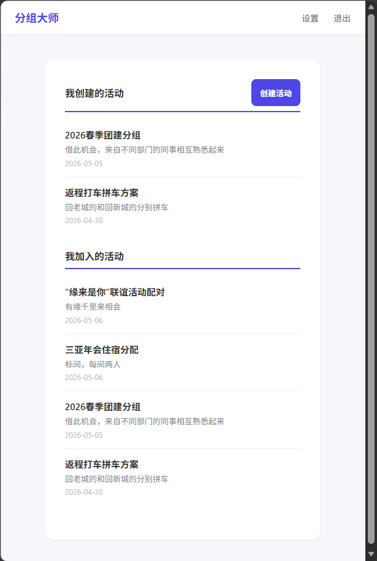
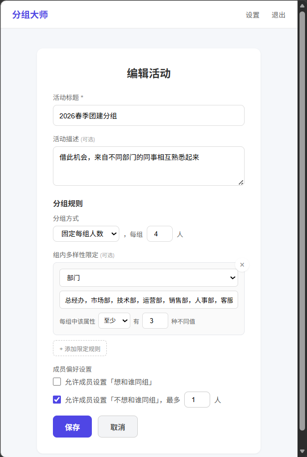
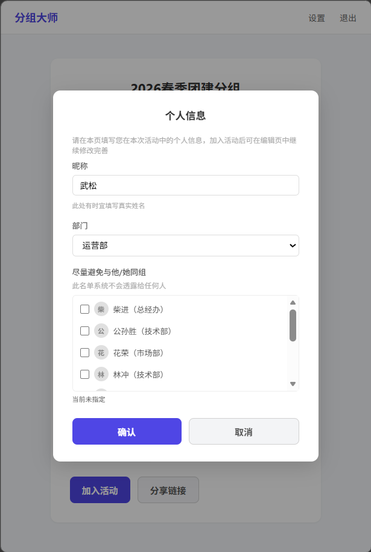
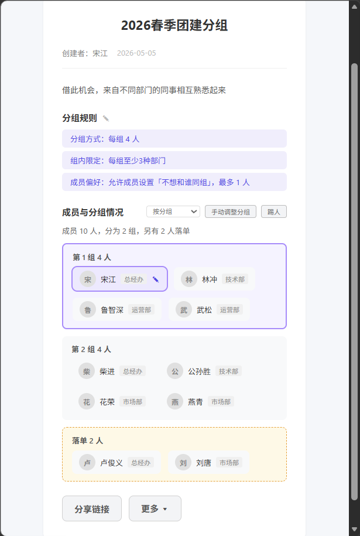

# 分组大师 (Grouping Master)

分组利器——按自定义约束自动平均分组，支持手动拖拽调整，实时追踪成员变动。适用于团建、课程分组、住宿分配等场景。

## 功能

- **成员管理**：注册、登录、个人属性、活动加入/退出
- **自动分组**：固定每组人数/固定总组数两种策略
- **组内规则**：设定属性要求（如每组至少一位男生、部门不能重复等），分组时自动满足
- **成员偏好**：设置想/不想同组的人，算法作为软约束尽量满足
- **手动调整**：拖拽成员在组间移动、新增/删除组，自由不受限
- **变动日志**：分组后加入/退出/踢出的成员一目了然

## 截图


*首页：我创建的活动与加入的活动列表*


*创建活动时可配置分组方式、组内规则和成员偏好*


*成员加入时填写个人属性，选择想同组或不想同组的人*


*分组完成，按组展示成员，支持手动调整和变动追踪*

## 技术栈

| 层 | 技术 |
|----|------|
| 前端 | Vue 3 + Vite + Pinia + Vue Router |
| 后端 | FastAPI + SQLAlchemy + Alembic |
| 数据库 | MySQL 8.0 |

## 快速开始

### 环境要求

- Python 3.12+（含 `venv` 模块：`sudo apt install python3.12-venv`）
- Node.js 18+（含 npm：`sudo apt install nodejs npm`）
- MySQL 8.0

### 创建数据库

在 MySQL 中创建数据库（如已存在可跳过）：

```sql
CREATE DATABASE grouping_master CHARACTER SET utf8mb4 COLLATE utf8mb4_unicode_ci;
```

### 后端

#### 配置环境变量

进入 `backend/` 目录，复制 `.env.example` 为 `.env`，按需修改：

```bash
cd backend
cp .env.example .env
```

主要配置项：

| 变量 | 说明 |
|------|------|
| `DB_HOST/PORT/USER/PASSWORD/NAME` | MySQL 连接信息 |
| `SECRET_KEY` | Session 签名密钥 |
| `SMTP_HOST/PORT/USER/PASSWORD/FROM` | 邮件服务（找回密码用） |
| `FRONTEND_URL` | 前端地址（CORS + 重置密码链接） |

#### 开发运行

```bash
cd backend
python3 -m venv venv && source venv/bin/activate
pip install -r requirements.txt
alembic upgrade head
uvicorn app.main:app --reload
```

> `alembic` 和 `uvicorn` 均由 `pip install -r requirements.txt` 安装到虚拟环境中，无需单独 `apt install`。

#### 生产运行

使用一键部署脚本 `deploy.sh`，自动完成拉取代码 → 安装前端依赖 → 构建前端 → 数据库迁移 → 重启服务：

```bash
# 默认 8000 端口
bash deploy.sh

# 指定端口
PORT=9000 bash deploy.sh

# 绑定 80 端口（需 root）
PORT=80 sudo -E bash deploy.sh
```

> 脚本启动后 `sleep 3` 然后自动健康检查，成功显示「部署完成」并删除旧版备份，失败则回滚前端构建产物。
> 后端自动托管前端的 `dist/` 静态文件，无需额外 Web 服务器。

#### 调试 SMTP 服务（可选）

开发环境中可使用 [aiosmtpd](https://github.com/aio-libs/aiosmtpd) 替代真实邮件服务，重置密码等邮件的原始内容将直接打印在终端。

```bash
# 安装（仅首次）
sudo apt install python3-aiosmtpd
# 启动调试 SMTP 服务
python3 -m aiosmtpd -n -l localhost:1025
```

然后将 `.env` 中 SMTP 相关配置设为：

```
SMTP_HOST=localhost
SMTP_PORT=1025
SMTP_USER=
SMTP_PASSWORD=
SMTP_FROM=noreply@localhost
SMTP_USE_SSL=false
SMTP_STARTTLS=false
```

> 终端输出的邮件内容为 MIME 原始格式，正文以 base64 编码显示属正常现象。后端同时会在 stderr 打印 `[DEV] 重置密码链接:` 便于直接复制使用。

### 前端

#### 配置环境变量

进入 `frontend/` 目录，复制 `.env.example` 为 `.env`：

```bash
cd frontend
cp .env.example .env
```

主要配置项：

| 变量 | 说明 |
|------|------|
| `VITE_API_BASE_URL` | 后端 API 地址，本地开发设为 `http://localhost:8000/api`，生产环境设为 `/api`（同端口） |
| `VITE_UPLOADS_URL` | 头像等静态资源地址，本地开发设为 `http://localhost:8000`，生产环境留空（同端口） |
| `VITE_ENABLE_PASSWORD_RESET` | 是否启用忘记密码功能，默认 `true`。设为 `false` 关闭 |

#### 开发运行

```bash
cd frontend
npm install
npm run dev   # 开发模式，默认 http://localhost:5173，API 请求通过 Vite proxy 转发到后端
```

> 生产部署由 `deploy.sh` 统一处理（含前端构建），见上方后端「生产运行」一节。

## 目录结构

```
backend/                    # FastAPI 后端
├── app/
│   ├── main.py            # 应用入口
│   ├── config.py          # 配置常量
│   ├── database.py        # 数据库引擎
│   ├── models/            # ORM 模型
│   ├── schemas/           # 请求/响应校验
│   ├── routers/           # API 路由
│   ├── services/          # 业务逻辑（含分组算法）
│   └── middleware/         # 认证、限流
└── alembic/               # 数据库迁移

frontend/                   # Vue 3 前端
└── src/
    ├── api/               # Axios + API 调用
    ├── stores/            # Pinia 状态
    ├── router/            # 路由 + 鉴权守卫
    ├── components/        # 通用组件
    └── views/             # 页面组件
```

## 反馈与贡献

- 问题与建议：[GitHub Issues](https://github.com/dongyue/grouping-master/issues)
- 联系作者：me@dongyue.name

## 许可证

[GNU Affero General Public License v3.0](LICENSE.txt)
